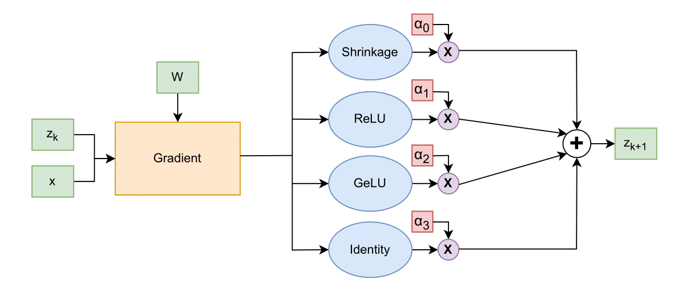
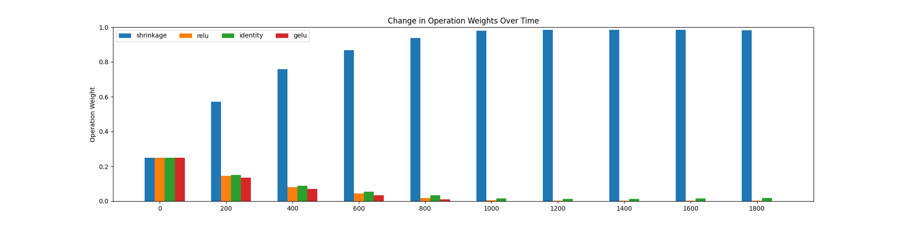

# Discovering Fast Iterative Shrinkage Thresholding Algorithm (FISTA) via Neural Architecture Search (NAS)

This repository implements a Differential Architecture Search (DARTS) trained neural network that learns the FISTA algorithm when given sparse coding training data. 

## Model Overview
We construct a simple DARTS cell as shown below. The model is defined as a gradient projection algorithm with four choices for the proximal operator. The goal of the DARTS procedure is to determine which proximal operator is the correct choice given the input data. In the below example, if our model learns to choose the "Shrinkage" operator we can see that the model has replicated the Iterative Shrinkage Thresholding Algorithm (ISTA). We eventually expand this search space such that the model has to learn whether to use momentum in the gradient projection (FISTA) as well as the number of iterations the algorithm must perform for an accurate output. 



In this plot, we see the above model chooses to start favoring the Shrinkage operator as early as the 200th epoch of training. As the training continues, we see that the model has confidently learned the Shrinkage operator and thus has replicated ISTA.



## Usage

1. Clone the repo and install the requirements in your python environment.
2. Run the training script ```python nas_search.py --job_id 0```
3. The job_id can be switched between 0 and 1 to see the impact of different learning rates on model training.
